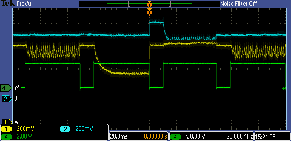
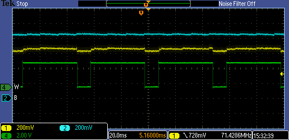
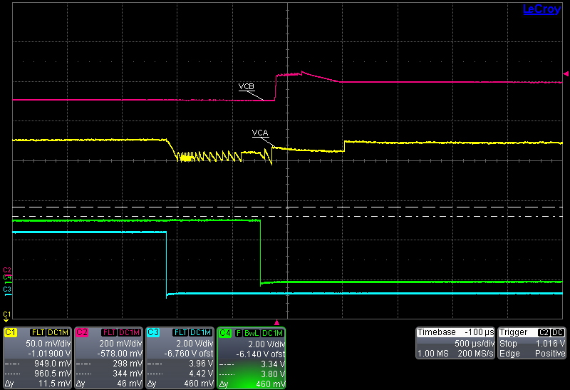
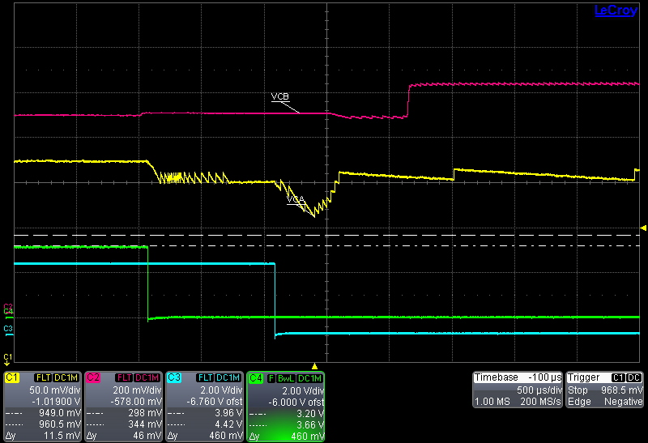

# LP_GPIO

Enter deep sleep with a GPIO wakeup. 

## Required Connections

- Connect a USB cable between the PC and the CN2 (USB/PWR) connector.
- Open an terminal application on the PC and connect to the EV kit's console UART at 115200, 8-N-1.
- Setup a signal generator on PB0(P1.6), 6 Hz, square wave, 1.6 VPP, 0.8V offset. This will wakeup the MAX32665 every 80 ms. 

## Expected Output

The Console UART of the device will output these messages:

MCR->ctrl should be 0xb after a POR, 0xf in subsequent events. Bit 2 is automatically
set by the hardware.

```
****Low Power Mode GPIO Example****                                             
                                                                                
MCR->ctrl = 0xb
```

## Questions

### **What is the minimum operating voltages in active and sleep?**
We're currently using 1.0V in active (VCOREA) and 0.81V (VCOREB) in sleep mode.

1.0V (VCOREA) at full speed is okay. VCOREB not in use in active mode.
0.85V (VCOREB) in deep sleep.

### **What is the effect of changing the operating voltage in sleep mode?**
Conserve power by lowering VCOREB in deep sleep. Do not raise VCOREB voltage unless VCOREA in soft start.


### **Why does the SIMO stop regulating coming into our out of deep sleep?**
This screenshot shows an unregulated period (~500 us) when entering deep sleep. The USB Switch is enabled, causing extra current consumption in deep sleep. Eventually the voltage levels out at a level below the set point.
With the USB Switch enabled, there is excess load on VCOREA in deep sleep. We can see that the voltage dips well below the set point while the SIMO is sleeping, resulting in a large spike when the SIMO wakes up.
It is believed that the SIMO is stuck in soft start while we're in deep sleep. We come out of deep sleep and detect the soft start state, switch the core supply to VCOREB, reducing the load on VCOREA, allowing the SIMO to recharge VCOREA. 
<p align="center">
  
</p>

With the USB Switch disabled, we reduce the load on VCOREA, preventing the soft start state on VCOREA.

<p align="center">
  
</p>

* Channel 1(Yellow) is VCORE_A(VREGO_C)
* Channel 2(Blue) is VCORE_B(VREGO_B)
* Channel 4(Green) is indicate active mode when low and sleep mode when high.

### **What is the current through VCOREA/B in deep sleep**
4.0 uA on VCOREA
10.4 uA on VCOREB.

### **Try a different duty cycle for wakeup pin**
Soft start observed more often with two asynchronous wakeup sources. Seems to happen often if we get a wakeup event right as the part enters deep sleep.


### **Running from slower system clock**
Causes part to take longer to wakeup. Also will cause VCOREA to dip further when recovering
from soft start.

<p align="center">
  
</p>

<p align="center">
  
</p>


### **Leaving 7.3728 MHz clock enabled.**
No significant different in current consumption while in deep sleep. Significant difference 
while in active mode.

```c
switchToHIRCD4();

MXC_GCR->clkcn |= (MXC_F_GCR_CLKCN_HIRC8M_EN); // 1.674 mA
// 1.599 mA with this clock source disabled.

while(1) {}
```

